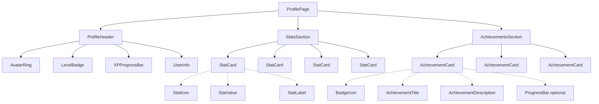

# Profile Page Redesign - Duolingo-Style Component Architecture

## Overview

This document outlines the new component architecture for the profile page, transforming it from a dashboard-style layout to a personal character page with a gamified, Duolingo-inspired feel.

---

## Design Philosophy

### Key Principles
- **Dark, futuristic, minimal theme** - Clean dark backgrounds with subtle depth
- **Soft gradients and glow effects** - No harsh borders, use gradient overlays and glows
- **Rounded corners** - Generous border-radius (16-24px) for friendly feel
- **Clear visual hierarchy** - Profile header as focal point, then stats, then achievements
- **Gamified experience** - Progress bars, badges, levels create engagement

### Visual Style

| Element | Current (Discord-style) | New (Duolingo-style) |
|---------|------------------------|----------------------|
| Background | `bg-gray-900/60` | `bg-gradient-to-b from-[#1a1d29] to-[#0f111a]` |
| Cards | `border-gray-800/50` | `bg-white/5` with subtle gradient border |
| Borders | 1px solid borders | No borders, use shadows and backgrounds |
| Progress | Solid gradient bar | Animated gradient with glow pulse |
| Typography | System fonts | Sora (already in config) with tight tracking |

---

## Component Hierarchy



---

## Component Specifications

### 1. ProfileHeader

**Purpose**: Main focal point - displays avatar, username, level, and XP progress

**Props Interface**:
```typescript
interface ProfileHeaderProps {
  name: string;
  avatarStage: string;
  level: number;
  currentXP: number;
  requiredXP: number;
  initials: string;
}
```

**Layout Structure**:
```
┌─────────────────────────────────────────┐
│              [Avatar Ring]              │
│           ┌───────────────┐            │
│           │      Initials │            │
│           │     (Avatar)  │            │
│           └───────────────┘            │
│            [Level Badge]                │
│                                         │
│         Username                       │
│         @avatarStage                   │
│                                         │
│    ████████████░░░░░░░░░░░             │
│    XP Progress Bar (with glow)         │
│                                         │
│         Level X • XXX/XXX XP            │
└─────────────────────────────────────────┘
```

**Styling Approach**:
- Container: `relative flex flex-col items-center py-8 px-6`
- Background: `bg-gradient-to-b from-violet-500/10 to-transparent rounded-3xl`
- Avatar Ring: `w-28 h-28 rounded-full bg-gradient-to-br from-violet-500 to-fuchsia-500 p-1 shadow-[0_0_30px_rgba(139,92,246,0.4)]`
- Avatar Inner: `w-full h-full rounded-full bg-[#1a1d29] flex items-center justify-center`
- Level Badge: `absolute -bottom-2 px-4 py-1 rounded-full bg-gradient-to-r from-violet-600 to-violet-500 text-white text-sm font-bold shadow-lg`
- XP Bar Container: `w-full max-w-sm h-3 rounded-full bg-white/10 overflow-hidden`
- XP Bar Fill: `h-full rounded-full bg-gradient-to-r from-violet-500 via-fuchsia-500 to-violet-500 animate-pulse shadow-[0_0_10px_rgba(139,92,246,0.6)]`

**Spacing Specifications**:
- Avatar to username: `mt-4`
- Username to XP bar: `mt-3`
- XP bar padding: `px-4 py-6`

---

### 2. StatCard

**Purpose**: Display key statistics in a 2x2 grid

**Props Interface**:
```typescript
interface StatCardProps {
  icon: React.ReactNode;
  value: string | number;
  label: string;
  color: 'amber' | 'emerald' | 'violet' | 'cyan';
  trend?: {
    value: number;
    direction: 'up' | 'down';
  };
}
```

**Color Mapping**:
| Color | Background | Icon Background | Icon Color | Border Glow |
|-------|------------|-----------------|------------|-------------|
| amber | `bg-amber-500/10` | `bg-amber-500/20` | `text-amber-400` | `ring-amber-500/20` |
| emerald | `bg-emerald-500/10` | `bg-emerald-500/20` | `text-emerald-400` | `ring-emerald-500/20` |
| violet | `bg-violet-500/10` | `bg-violet-500/20` | `text-violet-400` | `ring-violet-500/20` |
| cyan | `bg-cyan-500/10` | `bg-cyan-500/20` | `text-cyan-400` | `ring-cyan-500/20` |

**Layout Structure**:
```
┌─────────────────────────┐
│  ┌─────┐                │
│  │Icon │   [Value]      │
│  └─────┘   [Label]      │
└─────────────────────────┘
```

**Styling Approach**:
- Container: `p-5 rounded-2xl bg-white/5 border border-white/5 backdrop-blur-sm hover:bg-white/10 transition-all duration-300`
- Icon Wrapper: `w-12 h-12 rounded-xl flex items-center justify-center`
- Value: `text-3xl font-bold text-white mt-2`
- Label: `text-sm text-gray-400 font-medium`

**Grid Layout**:
```typescript
<div className="grid grid-cols-2 gap-4">
  {/* 2x2 grid for desktop, 1 column for mobile */}
</div>
```

**Responsive Breakpoints**:
- Mobile (<640px): `grid-cols-1`
- Tablet (640-1024px): `grid-cols-2`
- Desktop (>1024px): `grid-cols-2 with gap-4`

---

### 3. AchievementCard

**Purpose**: Display badges/achievements with optional progress

**Props Interface**:
```typescript
interface AchievementCardProps {
  id: string;
  icon: string | React.ReactNode;
  title: string;
  description: string;
  isUnlocked: boolean;
  progress?: {
    current: number;
    target: number;
  };
  unlockedAt?: string;
}
```

**Layout Structure**:
```
┌─────────────────────────────────────────────┐
│  [Icon/Badge]     [Title]                   │
│                    [Description]           │
│                    [Progress Bar optional]  │
└─────────────────────────────────────────────┘
```

**Styling Approach**:

**Unlocked State**:
- Container: `p-4 rounded-2xl bg-gradient-to-r from-violet-500/10 to-fuchsia-500/10 border border-violet-500/20`
- Icon: `w-14 h-14 rounded-full bg-gradient-to-br from-amber-400 to-amber-500 flex items-center justify-center text-2xl shadow-lg`

**Locked State**:
- Container: `p-4 rounded-2xl bg-white/5 border border-white/5 opacity-60`
- Icon: `w-14 h-14 rounded-full bg-gray-800 flex items-center justify-center text-2xl grayscale`

**Progress Bar** (when applicable):
- Container: `h-2 rounded-full bg-white/10 overflow-hidden`
- Fill: `h-full rounded-full bg-gradient-to-r from-emerald-400 to-emerald-500`

---

## Data Mapping

### From Profile Service to Components

The `buildProfile()` function returns:
```typescript
interface UserProfile {
  id: string;
  name: string;
  avatarStage: string;
  level: number;
  currentXP: number;
  requiredXP: number;
  dailyStreak: number;
  totalQuests: number;
  completedQuests: number;
  badges: string[];
  joinDate: string;
  currentMood: {
    emoji: string;
    label: string;
  };
}
```

**Mapping to Components**:

| Profile Field | Component | Prop |
|---------------|-----------|------|
| `name` | ProfileHeader | `name` |
| `avatarStage` | ProfileHeader | `avatarStage` |
| `level` | ProfileHeader | `level` |
| `currentXP / requiredXP` | ProfileHeader | `currentXP`, `requiredXP` |
| `name.split()` | ProfileHeader | `initials` (computed) |
| `dailyStreak` | StatCard | `value` (streak) |
| `completedQuests / totalQuests` | StatCard | `value` (quests done) |
| `badges.length` | StatCard | `value` (badges) |
| `currentMood.emoji` | StatCard | `value` (mood) |
| `badges` | AchievementCard | Array mapping |

### Statistics Section Mapping (2x2 Grid)

| Position | Stat | Icon | Color |
|----------|------|------|-------|
| 1 | Daily Streak | Flame | amber |
| 2 | Quests Completed | Target | emerald |
| 3 | Current Mood | Heart/Face | violet |
| 4 | Badges Earned | Award | cyan |

---

## Spacing & Layout Specifications

### Page Layout
```typescript
<div className="max-w-2xl mx-auto space-y-6 pb-10">
  {/* ProfileHeader */}
  {/* StatsSection */}
  {/* AchievementsSection */}
</div>
```

### Section Spacing

| Section | Margin Top | Padding | Border Radius |
|---------|------------|---------|---------------|
| ProfileHeader | 0 | `px-6 py-8` | `rounded-3xl` |
| StatsSection | `mt-6` | `p-4` | `rounded-2xl` |
| AchievementsSection | `mt-6` | `p-4` | `rounded-2xl` |

### Responsive Breakpoints

- **Mobile** (<640px): Single column, compact spacing
- **Tablet** (640-1024px): Full layout with adjusted padding
- **Desktop** (>1024px): Max-width container centered

---

## Animation Specifications

### ProfileHeader Animations

1. **Avatar Glow Pulse**:
   ```css
   @keyframes avatarGlow {
     0%, 100% { box-shadow: 0 0 20px rgba(139, 92, 246, 0.4); }
     50% { box-shadow: 0 0 40px rgba(139, 92, 246, 0.6); }
   }
   ```
   - Duration: 3s
   - Timing: ease-in-out
   - Iteration: infinite

2. **XP Bar Shimmer**:
   ```css
   @keyframes xpShimmer {
     0% { background-position: -200% 0; }
     100% { background-position: 200% 0; }
   }
   ```
   - Duration: 2s
   - Timing: linear
   - Iteration: infinite

### StatCard Animations

- **Hover**: `transform: translateY(-2px)` + brightness increase
- **Entrance**: Staggered fade-in with 50ms delay between cards

### AchievementCard Animations

- **Unlock**: Scale bounce + glow pulse (on mount if unlocked)
- **Hover**: Subtle lift effect

---

## Color Palette (Tailwind Extensions)

Add to `tailwind.config.js`:

```javascript
module.exports = {
  theme: {
    extend: {
      colors: {
        profile: {
          bg: '#1a1d29',
          card: 'rgba(255, 255, 255, 0.05)',
          cardHover: 'rgba(255, 255, 255, 0.10)',
        },
        glow: {
          violet: 'rgba(139, 92, 246, 0.4)',
          fuchsia: 'rgba(232, 121, 249, 0.4)',
        }
      },
      boxShadow: {
        'avatar': '0 0 30px rgba(139, 92, 246, 0.4)',
        'card': '0 4px 20px rgba(0, 0, 0, 0.3)',
      }
    }
  }
}
```

---

## Component File Structure

```
src/
└── components/
    └── profile/
        ├── ProfilePage.tsx          # Main page wrapper
        ├── ProfileHeader.tsx        # Avatar + level + XP
        ├── StatsSection.tsx         # 2x2 grid container
        ├── StatCard.tsx             # Individual stat display
        ├── AchievementsSection.tsx  # Vertical list container
        └── AchievementCard.tsx      # Individual achievement
```

---

## Implementation Notes

1. **Progressive Enhancement**: Start with ProfileHeader, then Stats, then Achievements
2. **Mobile-First**: Design for mobile, enhance for desktop
3. **Accessibility**: Maintain contrast ratios, support keyboard navigation
4. **Performance**: Use React.memo for stat cards, lazy load achievements section
5. **Theme Consistency**: Use CSS variables for all colors to enable future theming

---

## Migration Strategy

1. Create new component files under `src/components/profile/`
2. Replace current `page.tsx` to use new components
3. Gradually migrate features (edit modal, etc.)
4. Remove legacy styles from `globals.css`

---

## Summary

This architecture transforms the profile page from a dashboard to a personal character page with:
- **Clear focal point** via ProfileHeader with glowing avatar and level
- **Gamified stats** via colorful StatCards in a 2x2 grid  
- **Achievement system** via AchievementCards with progress tracking
- **Smooth animations** for engagement and delight
- **Dark, futuristic aesthetic** with soft gradients and glows
