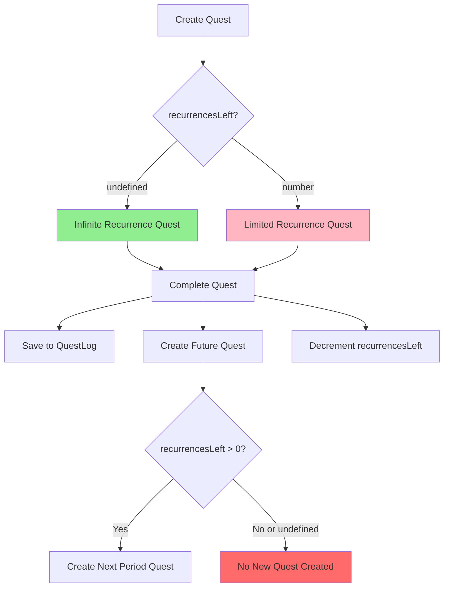
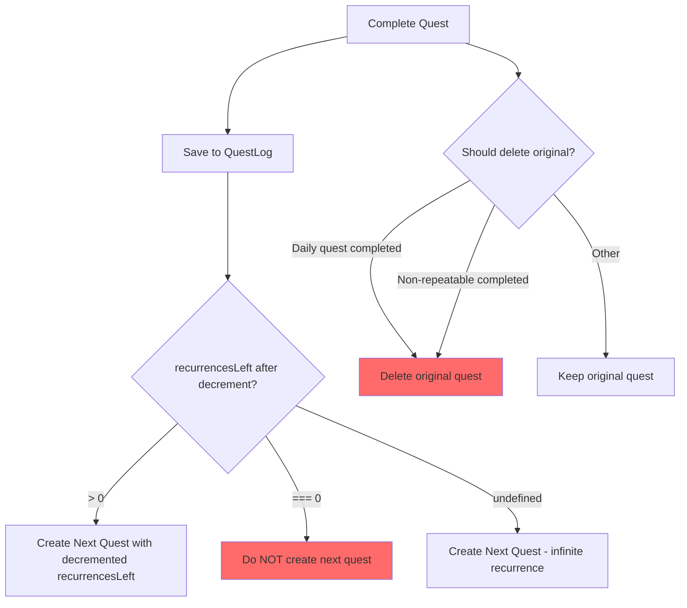

# Quest System Reset Design Document

## Overview

This document analyzes the current quest system architecture and proposes solutions for:
1. Resetting all quests after a day passes
2. Deleting non-repeatable quests

---

## Current System Analysis

### Data Models

#### Quest Model ([`src/lib/models/Quest.ts`](src/lib/models/Quest.ts))

```typescript
interface IQuest {
  userId: mongoose.Types.ObjectId;
  goal: string;
  duration: 'daily' | 'weekly' | 'monthly' | 'yearly';
  progress?: number;          // 0-100
  completed: boolean;
  date: Date;                 // Creation/scheduled date
  completedDate?: Date;       // When marked complete
  recurrencesLeft?: number;   // Optional: if undefined, infinite recurrences
}
```

**Key Fields:**
- `duration`: Defines the recurrence period
- `recurrencesLeft`: Controls finite vs infinite recurrence
  - `undefined` = infinite recurrences (default)
  - `number > 0` = finite recurrences remaining
  - `0` = no more recurrences (quest should be deleted)

#### QuestLog Model ([`src/lib/models/QuestLog.ts`](src/lib/models/QuestLog.ts))

```typescript
interface IQuestLog {
  userId: mongoose.Types.ObjectId;
  questId: mongoose.Types.ObjectId;
  goal: string;
  duration: 'daily' | 'weekly' | 'monthly' | 'yearly';
  progress: number;
  completedDate: Date;
  createdDate: Date;
  deletedDate?: Date;
  isDeleted: boolean;
}
```

**Purpose:** Historical record of completed quests for XP tracking and analytics.

### Current Behavior Flow



### API Endpoints

| Endpoint | Method | Purpose |
|----------|--------|---------|
| `/api/quest/all` | GET | Fetch all active quests for user |
| `/api/quest/create` | POST | Create new quest |
| `/api/quest/complete/[id]` | PUT | Toggle quest completion |
| `/api/quest/delete/[id]` | DELETE | Delete a quest |
| `/api/quest/log` | GET | Fetch quest history |

### Current Issues

1. **No Daily Reset Mechanism**: Completed daily quests remain visible; new quests are created for the next day but old ones persist.

2. **Non-Repeatable Quests Not Deleted**: When `recurrencesLeft` reaches 0, the completed quest remains in the database.

3. **Timezone Ambiguity**: Date calculations use server time without timezone awareness.

---

## Proposed Solutions

### Feature 1: Daily Reset Mechanism

#### Option A: Reset on Page Load (Recommended)

**Approach:** Check and reset quests when the user visits the quest page.

**Implementation:**
1. Add `lastResetDate` field to track when quests were last reset
2. On `/api/quest/all` call, compare current date with `lastResetDate`
3. If a new day has started in user's timezone:
   - Reset incomplete daily quests to `progress: 0, completed: false`
   - Archive completed daily quests to QuestLog if not already there
   - Delete completed daily quests from active collection

**Pros:**
- Simple implementation
- No external dependencies
- Works with user's timezone

**Cons:**
- Only triggers when user is active
- First load of the day may be slightly slower

#### Option B: Cron Job / Scheduled Task

**Approach:** Run a scheduled job at midnight to reset all users' quests.

**Implementation:**
1. Use Vercel Cron Jobs or external scheduler
2. Create `/api/cron/reset-quests` endpoint
3. Iterate through all users and reset their daily quests

**Pros:**
- Consistent timing
- Background processing

**Cons:**
- Requires external service
- Timezone complexity (whose midnight?)
- May process users who aren't active

#### Recommendation: Option A (Reset on Page Load)

This approach is simpler and respects the user's timezone naturally.

### Feature 2: Delete Non-Repeatable Quests

#### Definition of Non-Repeatable Quests

A quest is considered non-repeatable when:
- `recurrencesLeft === 0` (explicitly no more recurrences)
- The quest has been completed

#### Implementation Approach

**When to Delete:**
Delete non-repeatable quests immediately after completion, as part of the completion flow.

**Modified Flow:**



---

## Detailed Implementation Plan

### Schema Changes

#### Add to User Model or Create UserPreferences

```typescript
// Option 1: Add to User model
interface IUser {
  // ... existing fields
  lastQuestResetDate?: Date;
  timezone?: string; // Default: 'Asia/Bangkok'
}

// Option 2: Create separate collection for user preferences
interface IUserPreferences {
  userId: mongoose.Types.ObjectId;
  lastQuestResetDate: Date;
  timezone: string;
}
```

### New API Endpoint: `/api/quest/reset`

```typescript
// POST /api/quest/reset
// Called by frontend when detecting a new day

async function resetDailyQuests(userId: string, userTimezone: string) {
  const now = new Date();
  const todayStart = getStartOfDayInTimezone(now, userTimezone);
  
  // 1. Find all completed daily quests
  const completedDaily = await Quest.find({
    userId,
    duration: 'daily',
    completed: true,
    completedDate: { $lt: todayStart }
  });
  
  // 2. Archive to QuestLog if not already there
  for (const quest of completedDaily) {
    await QuestLog.findOneAndUpdate(
      { userId, questId: quest._id },
      { /* ... upsert data ... */ },
      { upsert: true }
    );
  }
  
  // 3. Delete completed daily quests
  await Quest.deleteMany({
    userId,
    duration: 'daily',
    completed: true,
    completedDate: { $lt: todayStart }
  });
  
  // 4. Reset incomplete daily quests from previous days
  await Quest.updateMany(
    {
      userId,
      duration: 'daily',
      completed: false,
      date: { $lt: todayStart }
    },
    {
      $set: { progress: 0, date: todayStart }
    }
  );
  
  // 5. Delete non-repeatable completed quests
  await Quest.deleteMany({
    userId,
    completed: true,
    recurrencesLeft: 0
  });
  
  // 6. Update last reset date
  await User.findByIdAndUpdate(userId, {
    lastQuestResetDate: now
  });
}
```

### Modified Complete Quest Flow

Update [`/api/quest/complete/[id]/route.ts`](src/app/api/quest/complete/[id]/route.ts):

```typescript
// After existing completion logic, add:

// For daily quests: delete the completed quest after creating next
if (quest.duration === 'daily' && nextCompleted) {
  await Quest.findByIdAndDelete(quest._id);
}

// For non-repeatable quests: delete after creating next
if (nextCompleted && nextRecurrencesLeft === 0) {
  await Quest.findByIdAndDelete(quest._id);
}
```

### Frontend Changes

Update [`src/app/dashboard/quest/page.tsx`](src/app/dashboard/quest/page.tsx):

```typescript
// Add timezone-aware date check
const checkAndResetQuests = async () => {
  const lastResetDate = localStorage.getItem('lastQuestResetDate');
  const now = new Date();
  const todayStart = new Date(now);
  todayStart.setHours(0, 0, 0, 0);
  
  if (lastResetDate) {
    const lastReset = new Date(lastResetDate);
    const lastResetDayStart = new Date(lastReset);
    lastResetDayStart.setHours(0, 0, 0, 0);
    
    if (lastResetDayStart < todayStart) {
      // New day detected, call reset endpoint
      await axios.post('/api/quest/reset', {}, {
        headers: { Authorization: `Bearer ${token}` }
      });
    }
  }
  
  localStorage.setItem('lastQuestResetDate', now.toISOString());
};

// Call in useEffect before fetching quests
useEffect(() => {
  checkAndResetQuests();
  fetchQuests();
  fetchQuestLogs();
}, []);
```

---

## Timezone Handling

### User Timezone: Asia/Bangkok (UTC+7)

**Recommendation:** Store user timezone preference and use it for all date calculations.

```typescript
// Utility function for timezone-aware date operations
function getStartOfDayInTimezone(date: Date, timezone: string): Date {
  const formatter = new Intl.DateTimeFormat('en-US', {
    timeZone: timezone,
    year: 'numeric',
    month: '2-digit',
    day: '2-digit'
  });
  
  const parts = formatter.formatToParts(date);
  const year = parts.find(p => p.type === 'year')?.value;
  const month = parts.find(p => p.type === 'month')?.value;
  const day = parts.find(p => p.type === 'day')?.value;
  
  // Create date in UTC that represents start of day in timezone
  return new Date(`${year}-${month}-${day}T00:00:00+07:00`);
}
```

---

## Summary of Changes

### Database Schema Changes

| Model | Change | Description |
|-------|--------|-------------|
| User | Add `lastQuestResetDate` | Track when quests were last reset |
| User | Add `timezone` | Store user timezone preference |

### New API Endpoints

| Endpoint | Method | Purpose |
|----------|--------|---------|
| `/api/quest/reset` | POST | Trigger daily quest reset |

### Modified Files

| File | Changes |
|------|---------|
| `src/lib/models/User.ts` | Add timezone and lastQuestResetDate fields |
| `src/app/api/quest/all/route.ts` | Optionally trigger reset check |
| `src/app/api/quest/complete/[id]/route.ts` | Delete completed daily/non-repeatable quests |
| `src/app/dashboard/quest/page.tsx` | Add reset check on page load |

---

## Implementation Priority

1. **High Priority:** Delete non-repeatable quests after completion
   - Simple change to complete endpoint
   - Immediate user benefit

2. **Medium Priority:** Daily reset mechanism
   - Requires schema changes
   - More complex logic

3. **Low Priority:** Timezone preference UI
   - Can default to Asia/Bangkok
   - Add settings page later

---

## Questions for Clarification

1. Should weekly/monthly/yearly quests also be reset/archived after their period ends?
2. Should users be able to see their quest history beyond the QuestLog?
3. Is there a preference for when the reset should occur (midnight, first login, etc.)?
